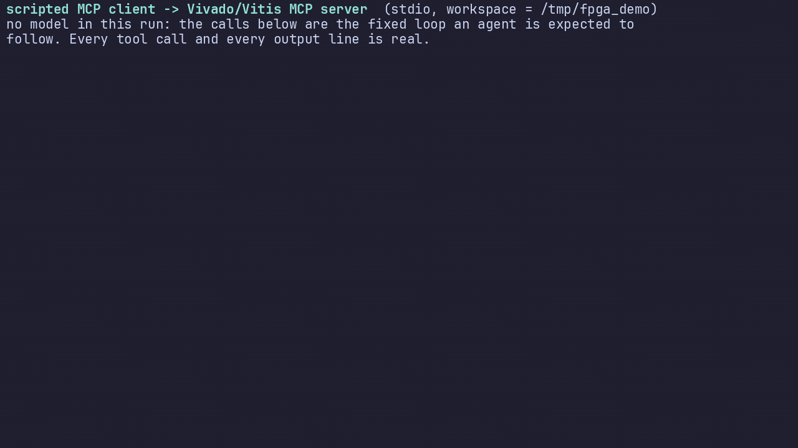

# LLM on Vivado & Vitis — version française

**Tout ce qu'il faut à un agent IA (ou à un humain) pour concevoir, vérifier et
construire des projets FPGA avec Vivado et Vitis sur Linux — sous forme de pack de
connaissances *et* de serveur MCP fonctionnel.**

Le but n'est pas un tutoriel humain de plus : c'est que *n'importe quel* LLM — un
petit modèle local via Ollama comme un modèle de pointe dans un agent de codage —
dispose d'informations précises et **vérifiées** pour écrire du VHDL synthétisable,
écrire et lancer des testbenches, piloter Vivado en batch, lire ses propres logs
d'erreur et construire une application embarquée avec Vitis. Sans expérience
préalable de Vivado, et sans outil propriétaire pour commencer.

- Cible : **Linux uniquement** (bash, `settings64.sh`, pas de chemins Windows).
- Versions : vérifié sur **Vivado / Vitis 2025.2** ; les différences 2020.2+ et
  2023.2+ sont signalées là où elles comptent.
- Générique : rien n'est lié à une carte ou à un design particulier. Les `examples/`
  montrent la **structure**, pas « le » projet.

---

## Démarrage rapide — 2 minutes, sans licence

```bash
# 1. simulateur libre + framework de test (sans root)
curl -sL -o /tmp/ghdl.tgz \
  https://github.com/ghdl/ghdl/releases/download/v6.0.0/ghdl-mcode-6.0.0-ubuntu24.04-x86_64.tar.gz
mkdir -p /tmp/ghdl_tool && tar xzf /tmp/ghdl.tgz -C /tmp/ghdl_tool --strip-components=1
python3 -m venv ~/.venv-fpga && . ~/.venv-fpga/bin/activate && pip install "cocotb>=2.0,<3"

# 2. lancer un exemple vérifié
cd examples/01-counter-cocotb/tb
PATH=/tmp/ghdl_tool/bin:$PATH make          # -> TESTS=3 PASS=3 FAIL=0
PATH=/tmp/ghdl_tool/bin:$PATH make WAVES=1  # -> counter.ghw (GTKWave / Surfer)
```

## Démarrage rapide — vrai Vivado (batch, depuis un script)

```bash
source ~/vivado/2025.2/Vivado/settings64.sh          # ou /tools/Xilinx/Vivado/2025.2/...
vivado -mode batch -source templates/vivado/create_project.tcl -nolog -nojournal \
       -tclargs --name prj --part xc7z020clg400-1 --top top
vivado -mode batch -source templates/vivado/build.tcl -nolog -nojournal \
       -tclargs --xpr prj/prj.xpr --to bitstream --jobs 4
# -> == impl_1 : PROGRESS=100% STATUS=write_bitstream Complete!
#    == TIMING: WNS = 7.317 ns
#    == BITSTREAM: prj/prj.runs/impl_1/top.bit
```
Les deux scripts sont idempotents (un run terminé est réutilisé, pas planté), ils
produisent les rapports **même** quand le bitstream échoue, et renvoient un code
retour non nul en cas d'échec — ce qu'un agent doit tester. `--allow-unconstrained 1`
couvre le cas « valider la logique sans carte » (voir `docs/10-troubleshooting.md` §3).

---

## Trois façons de brancher un LLM

| Moyen | Pour qui | Comment |
|---|---|---|
| **Serveur MCP** | agents avec appel d'outils (Claude Desktop/Code, VS Code+Copilot, Cline, Continue, Hermes…) | `mcp/` — 18 outils : lancer Vivado/Vitis, suivre un job, filtrer son log, analyser les rapports, lancer cocotb, programmer la carte (avec confirmation). Voir [`mcp/README.md`](mcp/README.md) |
| **Skills** | agents qui chargent des instructions à la demande | `skills/*/SKILL.md` (un par tâche : projet Vivado en Tcl, VHDL synthétisable, testbench cocotb, XDC, timing, Vitis, MCP, dépannage) |
| **Prompt compact** | tout LLM local sans outils | coller [`prompts/quickref.fr.md`](prompts/quickref.fr.md) (ou [`quickref.md`](prompts/quickref.md) en anglais) comme prompt système ; recettes de tâches dans [`prompts/recipes.md`](prompts/recipes.md) |

Un agent sans MCP n'est pas bloqué : chaque étape existe sous forme de script qu'il
peut faire exécuter (`templates/vivado/*.tcl`, `templates/cocotb/*`).

---

## Contenu

```
AGENTS.md              contrat pour un agent qui travaille DANS ce dépôt (à lire d'abord)
prompts/               quickref (FR/EN), prompt système complet, recettes de tâches
skills/                un SKILL.md par tâche, avec references/
docs/                  la documentation de référence (index : docs/README.md)
  ├── 01-toolchain.md         installation Linux, chemins, licences, udev, outillage libre
  ├── 02-vivado-tcl.md        flux project/non-project, logs, pièges vérifiés
  ├── 03-simulation.md        XSim vs GHDL vs cocotb, avec sorties réelles
  ├── 04-cocotb-recipes.md    motifs de testbench qui tournent vraiment
  ├── 06/07                   contraintes XDC, fermeture du timing
  ├── 08-vitis.md             xsct (≤2023.1) vs `vitis -s` (≥2023.2), XSA, boot
  ├── 10-troubleshooting.md   catalogue d'erreurs Vivado RÉELLES → correctif
  ├── 11-agent-workflow.md    la boucle de travail imposée à un agent
  ├── _research/              notes de recherche brutes, sources citées
  └── demo/                   une vraie session d'agent enregistrée : GIF + .cast + script
templates/             scripts Tcl · Makefiles cocotb + helpers · squelettes VHDL
                       contraintes · squelette de projet avec Makefile
examples/              01 compteur · 02 ALU · 03 FIFO · 04 testbench VHDL pur (XSim)
                       05 datapath RISC-V (structure de référence) · 06 PS/PL + Vitis
mcp/                   le serveur MCP (Python), configs clients, ses propres tests
scripts/               check_tcl.py (valide tous les scripts Tcl), utilitaires
```

## Version

Langue principale : l'anglais, avec les miroirs français conservés à côté (`README.fr.md`,
`mcp/README.fr.md`, `examples/07-mini-gpu-mandelbrot/README.fr.md`).
État de la traduction : les documents de vitrine (ce fichier, `README.md`, `AGENTS.md`,
`docs/README.md`, `mcp/README.md`, `examples/07/README.md`, `prompts/quickref.md`,
`prompts/recipes.md`) sont en anglais ; `docs/01`→`11`, `CONTRIBUTING.md`, les README des
exemples, les `skills/*/SKILL.md`, `templates/` et les docstrings/messages du serveur MCP
(`mcp/vivado_mcp/*.py`, ~171 lignes) sont encore en français. `docs/README.md` tient
l'état fichier par fichier plutôt qu'une liste figée ici.

**v1.0** — première version considérée comme utilisable telle quelle (`git tag -l`).
État vérifié au moment du tag :

| Élément | État |
|---|---|
| Exemples 01 → 07 | tous exécutés ; `examples/07` (mini-GPU SIMT) vérifie en plus 6 configurations mesurées |
| Serveur MCP | 52 tests passent (`cd mcp && python -m pytest -q`) |
| Scripts Tcl | validés sans Vivado (`python3 scripts/check_tcl.py`) et exécutés avec Vivado 2025.2 |
| Vivado / Vitis | flux complets réellement exécutés (synthèse → bitstream → XSA ; `vitis -s`) |
| Tout rejouer | `bash scripts/verify_all.sh` |

Ce qui n'est **pas** couvert, et qui est écrit noir sur blanc dans les docs : la
programmation JTAG (aucune carte), le flux Vitis de bout en bout sur cible Zynq, et un
design en violation de timing.

Rejoué depuis sur la machine de référence : `bash scripts/verify_all.sh` → **9 OK /
0 ECHEC / 4 IGNORE**, à condition de mettre `cocotb-config` et le GHDL du démarrage
rapide dans le `PATH` (le `ghdl` installé dans `/usr/bin` refuse les surcharges de
génériques à l'élaboration et fait échouer `examples/07`).

## Voir tourner — les appels sont réels, et aucun modèle n'est dans la boucle



Soyons précis sur ce que c'est, parce que c'est vite survendu : un **client MCP scripté**
(`docs/demo/mcp_tool_loop.py`) appelle le serveur en stdio dans l'ordre qu'un agent est censé
suivre — écrire le RTL, le simuler, le synthétiser, relire le rapport de timing. **Il n'y a
aucun LLM dedans** : la séquence est figée dans le script, et le VHDL du compteur aussi. Ce
qui est réel, c'est tout ce que fait le serveur : chaque appel d'outil, chaque résultat,
chaque ligne de sortie, sur un vrai Vivado 2025.2 et GHDL 6.0.0. Rien n'est mis en scène non
plus (`docs/demo/mcp-tool-loop.cast` est l'enregistrement asciinema brut ; `cast2gif.py` le
rejoue en GIF — seuls les temps morts sont compressés, rien d'autre n'est retouché).

| Étape | Appel d'outil | Résultat de ce run |
|---|---|---|
| 1 | `env_info(deep=True)` | Vivado v2025.2, XSim v2025.2, GHDL 6.0.0, cocotb 2.0.1, make 4.4.1 |
| 2–3 | `write_text_file` | un compteur 8 bits (871 caractères) + un XDC `create_clock` 100 MHz |
| 4–6 | `cocotb_run` → `cocotb_results` | `TESTS=3 PASS=3 FAIL=0 ERRORS=0`, 1,0 s |
| 7 | `vivado_run(create_project.tcl)` | projet + sources + contraintes, rc=0 |
| 8 | `vivado_run(build.tcl --to implementation)` | `PROGRESS=100% STATUS=route_design Complete!`, 82,2 s |
| 9 | `job_log(errors_only=True)` | 0 erreur, 0 avertissement |
| 10 | `project_status` + `report_summary` | **WNS = 7.915 ns**, TNS 0.000, `timing_met=true` |

Cette boucle est exactement celle que le champ `instructions` du serveur demande à un agent de
suivre, et l'avoir en script a un intérêt : elle se rejoue, se chronomètre et se diffe à la
demande, sans modèle ni clé d'API — ce qui en fait un test de non-régression plutôt qu'une
démo. Pour voir un modèle choisir lui-même ses appels, branche le serveur sur ton client :
c'est le travail de ton agent, pas de ce dépôt.

Pour reproduire (le workspace est un dossier temporaire, jamais ce dépôt) :

```bash
python3 -m venv mcp/.venv && mcp/.venv/bin/pip install -r mcp/requirements.txt asciinema
mkdir -p /tmp/fpga_demo/rtl /tmp/fpga_demo/tb /tmp/fpga_demo/scripts
cp templates/vivado/*.tcl          /tmp/fpga_demo/scripts/
cp examples/01-counter-cocotb/tb/* /tmp/fpga_demo/tb/
mcp/.venv/bin/python docs/demo/mcp_tool_loop.py --workspace /tmp/fpga_demo
```

### Et le matériel lui-même : ce que rend le mini-GPU (exemple 07)


Pas un rendu logiciel non plus. Chaque image de ce zoom sort de l'accélérateur SIMT décrit
dans [`examples/07-mini-gpu-mandelbrot`](examples/07-mini-gpu-mandelbrot/README.md) — 16
voies en VHDL, une élaboration par image puisque la fenêtre du plan complexe *est* un
générique — et chacune est comparée pixel par pixel au modèle de référence Python avant
d'être écrite : une image fausse ferait échouer le run au lieu de livrer un joli mensonge.

| Propriété | Valeur de ce run |
|---|---|
| Images / résolution | 12 × (128×96), agrandies ×8 au plus proche voisin : rien n'est interpolé |
| Zoom | ×0,72 par image → 39×, centré sur la « seahorse valley » |
| Vérification | **12 / 12 `PASS`** (égalité exacte avec le modèle de référence) |
| Coût | 68 s à 245 s par image, ~40 min au total, **un seul cœur** |

Cette dernière ligne est la partie honnête de l'histoire GPU : **GHDL est mono-thread**,
donc une simulation occupe un cœur quel que soit `C_LANES` — les voies sont exécutées cycle
par cycle dans le simulateur et ne deviennent du débit qu'en silicium. Le parallélisme qui
existe vraiment est *entre les images*, d'où `render_zoom.py --jobs 6` (mesuré ×2,4 sur 4
images, PNG identiques octet pour octet). Le débit mesuré du même design face à un CPU est
en §4 du README de cet exemple — et le CPU gagne, ce qui se lit aussi.

## Politique de vérification de ce dépôt

Chaque affirmation non triviale est soit **mesurée**, soit explicitement signalée
comme non vérifiée. Rien n'est présenté comme vrai « parce que ça sonne bien ».

| Vérifié (sur cette machine) | Comment |
|---|---|
| Flux Vivado complet jusqu'au bitstream | exécuté sur Vivado 2025.2 ; `top.bit` de 4 Mo, WNS 7.317 ns |
| Scripts Tcl valides | `info complete` (`tclsh`) sur les 8 scripts + exécution réelle |
| Testbenches qui passent | `make` sur chaque exemple, sorties citées dans les README |
| Le serveur MCP pilote un vrai Vivado | synthèse lancée à travers lui (rc=0, 28,6 s), logs et rapports analysés |
| Analyseurs de rapports/logs | tests unitaires sur des rapports **authentiques** de 2025.2 et un vrai `results.xml` cocotb |
| XSim et GHDL concordent | même testbench VHDL : 4695 vérifications, 0 erreur, mêmes instants sous les deux |

Non vérifié, et dit tel quel dans la doc : programmation JTAG (aucune carte branchée),
flux Vitis complet (pas de cible Zynq), design en violation de timing (fixture
synthétique), gros composants (pas de licence). Les limites de l'écosystème sont
documentées aussi — par exemple **cocotb ne supporte pas XSim**, ce qui change la
façon de vérifier un projet Vivado-only.

## Contribuer

Voir [`CONTRIBUTING.md`](CONTRIBUTING.md). Règles qui comptent : commandes
copiables, version d'outil précisée dès que le comportement en dépend, source AMD
citée pour tout comportement de Vivado/Vitis, et jamais d'affirmation « ça marche »
sans un log derrière.

## Licence

MIT (voir [`LICENSE`](LICENSE)). Vivado, Vitis et XSim sont des outils propriétaires
AMD et ne sont **pas** distribués ici ; la chaîne libre utilisée par les exemples
(GHDL, cocotb, Icarus, Verilator, GTKWave) est open source.
