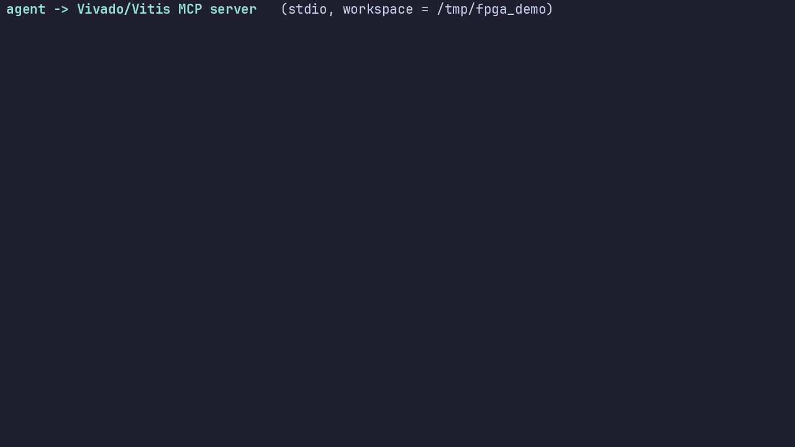

# LLM on Vivado & Vitis

**Everything an AI agent (or a human) needs to design, verify and build FPGA projects
with AMD/Xilinx Vivado and Vitis on Linux — as a knowledge pack *and* a working MCP
server.**

The point is not "a tutorial for humans". It is: *any* LLM — a local 8B model behind
Ollama, or a frontier model in a coding agent — gets enough precise, **verified**
information to write synthesizable VHDL, write and run testbenches, drive Vivado in
batch, read its own error logs, and build an embedded application with Vitis. No
Vivado experience required beforehand, no proprietary tool needed to start.

- Target platform: **Linux only** (bash, `settings64.sh`, no Windows `.bat` paths).
- Tool versions: verified on **Vivado / Vitis 2025.2**; differences for 2020.2+ and
  2023.2+ are flagged where they matter.
- Project-agnostic: nothing here is tied to a particular board or design. The
  `examples/` show the *structure*, not "the" project.

---

## Quickstart — 2 minutes, no licence

```bash
# 1. free simulator + test framework (no root needed)
curl -sL -o /tmp/ghdl.tgz \
  https://github.com/ghdl/ghdl/releases/download/v6.0.0/ghdl-mcode-6.0.0-ubuntu24.04-x86_64.tar.gz
mkdir -p /tmp/ghdl_tool && tar xzf /tmp/ghdl.tgz -C /tmp/ghdl_tool --strip-components=1
python3 -m venv ~/.venv-fpga && . ~/.venv-fpga/bin/activate && pip install "cocotb>=2.0,<3"

# 2. run a verified example
cd examples/01-counter-cocotb/tb
PATH=/tmp/ghdl_tool/bin:$PATH make          # -> TESTS=3 PASS=3 FAIL=0
PATH=/tmp/ghdl_tool/bin:$PATH make WAVES=1  # -> counter.ghw (GTKWave / Surfer)
```

## Quickstart — real Vivado (batch, from a script)

```bash
source ~/vivado/2025.2/Vivado/settings64.sh          # or /tools/Xilinx/Vivado/2025.2/...
vivado -mode batch -source templates/vivado/create_project.tcl -nolog -nojournal \
       -tclargs --name prj --part xc7z020clg400-1 --top top
vivado -mode batch -source templates/vivado/build.tcl -nolog -nojournal \
       -tclargs --xpr prj/prj.xpr --to bitstream --jobs 4
# -> == impl_1 : PROGRESS=100% STATUS=write_bitstream Complete!
#    == TIMING: WNS = 7.317 ns
#    == BITSTREAM: prj/prj.runs/impl_1/top.bit
```
Both scripts are idempotent (a completed run is reused, not crashed into), always
produce reports even when the bitstream fails, and exit non-zero on failure — which
is what an agent must check. `--allow-unconstrained 1` handles the "verify the logic
without a board" case (see `docs/10-troubleshooting.md` §3).

---

## Three ways to plug an LLM into this

| Way | For | How |
|---|---|---|
| **MCP server** | agents with tool calling (Claude Desktop/Code, VS Code+Copilot, Cline, Continue, Hermes…) | `mcp/` — 18 tools: run Vivado/Vitis, follow a job, filter its log, parse reports, run cocotb, program the FPGA (with confirmation). See [`mcp/README.md`](mcp/README.md) |
| **Skills** | agents that load instructions on demand | `skills/*/SKILL.md` (one per task: Vivado Tcl project, synthesizable VHDL, cocotb testbench, XDC, timing, Vitis, MCP, troubleshooting) |
| **Compact prompt** | any local LLM, no tool support | paste [`prompts/quickref.md`](prompts/quickref.md) (EN) or [`prompts/quickref.fr.md`](prompts/quickref.fr.md) as the system prompt; task recipes in [`prompts/recipes.md`](prompts/recipes.md) |

An agent without MCP is not stuck: every step exists as a script it can ask the user
to run (`templates/vivado/*.tcl`, `templates/cocotb/*`).

---

## What's inside

```
AGENTS.md              contract for an AI agent working in this repo (read first)
prompts/               quickref (EN/FR), full system prompt, task recipes
skills/                SKILL.md per task, with references/
docs/                  the reference material (see docs/README.md for the index)
  ├── 01-toolchain.md         Linux install, paths, licences, udev, free toolchain
  ├── 02-vivado-tcl.md        project + non-project flows, logs, verified pitfalls
  ├── 03-simulation.md        XSim vs GHDL vs cocotb, with real outputs
  ├── 04-cocotb-recipes.md    testbench patterns that actually run
  ├── 06/07                   XDC constraints, timing closure
  ├── 08-vitis.md             xsct (≤2023.1) vs `vitis -s` (≥2023.2), XSA, boot
  ├── 10-troubleshooting.md   catalogue of REAL Vivado error messages → fix
  ├── 11-agent-workflow.md    the loop an agent must follow
  ├── _research/              raw research notes with sources
  └── demo/                   a real agent-loop recording: GIF + .cast + the script
templates/             vivado/ tcl scripts · cocotb/ makefiles+helpers · vhdl/ skeletons
                       constraints/ · project/ (project skeleton + Makefile toolbox)
examples/              01 counter · 02 ALU · 03 FIFO · 04 pure-VHDL testbench (XSim)
                       05 RISC-V datapath (reference structure) · 06 PS/PL + Vitis
                       07 mini-GPU: SIMT Mandelbrot accelerator (16 lanes, measured)
mcp/                   the MCP server (Python), client configs, its own test suite
scripts/               check_tcl.py (validates every Tcl script), helpers
```

## See it run — a real session, not a mock-up



That GIF is a **real run**, recorded with `asciinema` on the reference machine
(`docs/demo/agent-loop.cast` is the untouched recording; `docs/demo/cast2gif.py` replays
it into a GIF — idle time is compressed, nothing else is edited). Over the MCP server,
in one loop, the agent does this:

| Step | Tool call | Result of that run |
|---|---|---|
| 1 | `env_info(deep=True)` | Vivado v2025.2, XSim v2025.2, GHDL 6.0.0, cocotb 2.0.1, make 4.4.1 |
| 2–3 | `write_text_file` | an 8-bit counter (871 chars) + a 100 MHz `create_clock` XDC |
| 4–6 | `cocotb_run` → `cocotb_results` | `TESTS=3 PASS=3 FAIL=0 ERRORS=0`, 1.1 s |
| 7 | `vivado_run(create_project.tcl)` | project + sources + constraints, rc=0 |
| 8 | `vivado_run(build.tcl --to implementation)` | `PROGRESS=100% STATUS=route_design Complete!`, 84.7 s |
| 9 | `job_log(errors_only=True)` | 0 errors, 0 warnings |
| 10 | `project_status` + `report_summary` | **WNS = 7.915 ns**, TNS 0.000, `timing_met=true` |

Reproduce it (the workspace is a scratch directory, never this repository):

```bash
python3 -m venv mcp/.venv && mcp/.venv/bin/pip install -r mcp/requirements.txt asciinema
mkdir -p /tmp/fpga_demo/rtl /tmp/fpga_demo/tb /tmp/fpga_demo/scripts
cp templates/vivado/*.tcl          /tmp/fpga_demo/scripts/
cp examples/01-counter-cocotb/tb/* /tmp/fpga_demo/tb/
mcp/.venv/bin/python docs/demo/agent_loop_demo.py --workspace /tmp/fpga_demo
```

Limits of this demo, said plainly: the design has **no pin assignment**, so the flow
stops at `--to implementation` (real post-route timing, no bitstream); the GIF is a
*rendered* terminal (pyte + Pillow + ffmpeg), not a pixel capture of a desktop; and the
module written is this repository's own counter — the smallest design whose timing
report means anything.

### And the hardware itself: what the mini-GPU renders (example 07)


Not a software render either. Each image of that zoom comes out of the SIMT accelerator
described in [`examples/07-mini-gpu-mandelbrot`](examples/07-mini-gpu-mandelbrot/README.md)
— 16 lanes in VHDL, one elaboration per image because the complex-plane window *is* a
generic — and every image is compared pixel by pixel with the Python reference model
before being written, so a wrong one fails the run instead of shipping a pretty lie.

| Property | Value of that run |
|---|---|
| Images / resolution | 12 × (128×96), enlarged ×8 nearest-neighbour: nothing interpolated |
| Zoom | ×0.72 per image → 39×, centred on the "seahorse valley" |
| Verification | **12 / 12 `PASS`** (exact equality with the reference model) |
| Cost | 68 s to 245 s per image, ~40 min total, **one core** |

That last line is the honest part of the GPU story: **GHDL is single-threaded**, so one
simulation occupies one core whatever `C_LANES` is — the lanes are executed cycle by cycle
inside the simulator and only become throughput in silicon. The parallelism that does
exist is between images, hence `render_zoom.py --jobs 6` (measured ×2.4 on 4 images, with
byte-identical PNGs). The same design's measured throughput against a CPU is in §4 of that
example's README — and the CPU wins there, which is also worth reading.

## Version

Primary language: English, with French mirrors kept alongside (`README.fr.md`,
`mcp/README.fr.md`).
Language status: the front-page documents (this README, README.fr.md, AGENTS.md,
docs/README.md, mcp/README.md, `prompts/quickref.md`, `prompts/recipes.md`) are English;
docs/01–11, CONTRIBUTING.md, the examples' READMEs, the `skills/*/SKILL.md` files and
`templates/` are still being translated from French, as are the MCP server's Python
docstrings and messages (`mcp/vivado_mcp/*.py`, ~171 lines) — translations in progress,
and `docs/README.md` tracks the per-file state (which reference files are still French)
rather than freezing a list here.

**v1.0** — first version considered usable as-is (`git tag -l`).
State verified at tag time:

| Item | State |
|---|---|
| Examples 01 → 07 | all executed; `examples/07` (mini-GPU SIMT) additionally verifies 6 measured configurations |
| MCP server | 52 tests pass (`cd mcp && python -m pytest -q`) |
| Tcl scripts | validated without Vivado (`python3 scripts/check_tcl.py`) and executed with Vivado 2025.2 |
| Vivado / Vitis | full flows actually executed (synthesis → bitstream → XSA; `vitis -s`) |
| Replay everything | `bash scripts/verify_all.sh` |

What is **not** covered, and is written plainly in the docs: JTAG programming (no board),
the end-to-end Vitis flow on a Zynq target, and a timing-violating design.

## Verification policy of this repository

Every non-obvious claim is either measured or explicitly flagged as unverified.
Nothing here is presented as fact because it "sounds right".

**Reproduce all of it yourself:**

```bash
bash scripts/verify_all.sh        # 11 checks: every example + templates + MCP tests
                                  # + the Tcl scripts, and (if Vivado is in PATH)
                                  # a real synthesis whose reports are then parsed
```
The script prints `OK` only on a null exit code and says `IGNORE` (never `OK`) for
anything it could not run — e.g. XSim when Vivado is not sourced.

| Verified (on this machine) | How |
|---|---|
| Full Vivado flow to a bitstream | executed on Vivado 2025.2; `top.bit` 4 MB, WNS 7.317 ns |
| Tcl scripts are structurally valid | `tclsh` `info complete` on all 8 scripts + real execution |
| Testbenches pass | `make` on every example; outputs quoted in the READMEs |
| The MCP server drives real Vivado | synthesis launched through it (rc=0, 28.6 s), logs and reports parsed |
| Report/log parsers | unit tests against **authentic** Vivado 2025.2 reports and a real cocotb `results.xml` |
| XSim and GHDL agree | same VHDL testbench: 4695 checks, 0 errors, same end time under both |

Not verified, and said so in the docs: JTAG programming (no board attached), full
Vitis flow (no Zynq target), a timing-violating design (synthetic fixture), large
devices (no licence). Known limitations of the ecosystem are documented too — e.g.
**cocotb does not support XSim**, which changes how you verify a Vivado-only project.

## Contributing

See [`CONTRIBUTING.md`](CONTRIBUTING.md). Rules that matter: keep commands
copy-pasteable, state the tool version for anything version-dependent, cite an AMD
source for Vivado/Vitis behaviour, and never claim something works without a log.

## Licence

MIT (see [`LICENSE`](LICENSE)). Vivado, Vitis and XSim are proprietary AMD tools and
are **not** distributed here; the free toolchain used by the examples (GHDL, cocotb,
Icarus, Verilator, GTKWave) is open source.
