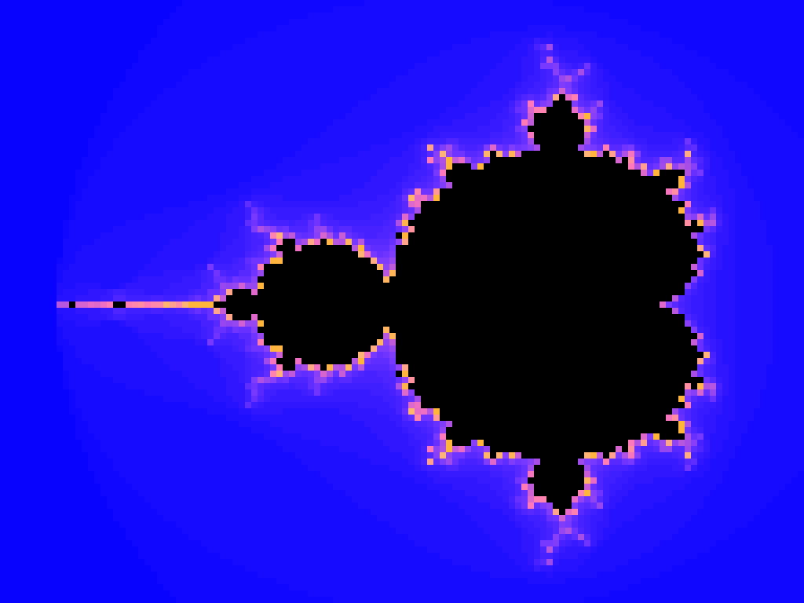

# 07 — Mini-GPU: a SIMT accelerator that computes the Mandelbrot fractal

*(French original kept in [`README.fr.md`](README.fr.md))*

This example builds a **small GPU in VHDL**: a SIMT engine with `C_LANES` lanes that
computes a Mandelbrot image in parallel, with a work dispatcher, lane divergence and a
result queue. It is **synthesizable on this repository's chip**
(`xc7z020clg400-1`) and **verified by simulation** against a reference model.

The goal is not to beat a CPU (the honest comparison is further down, and the CPU
wins on raw throughput): it is to show, with measured numbers, **how you actually
parallelize** and what that parallelization costs.

---

## 1. Why Mandelbrot is the right "kernel"

| Property | Consequence for the hardware |
|---|---|
| Each pixel is independent | no lock, no data sharing between lanes |
| The work per pixel is **variable** (1 to `C_MAX_ITER` iterations) | divergence: some lanes finish very fast, others stall |
| The computation is iterative and arithmetic (`z ← z² + c`) | lends itself to a state machine + dedicated multipliers |
| The result is **visually verifiable** | a single wrong image is immediately visible |

## 2. Architecture (the GPU analogy, term by term)

```
                        ┌──────────────── dispatcher ─────────────────┐
   next pixel ─────────►│ raster scan line by line, 1 point/cycle     │
   (x, y)               │ gate: (lane free) AND (slot free)           │
                        └──────┬─────┬─────┬─────────┬────────────────┘
                               │     │     │         │     c = x0 + x*dx + i*(y0 + y*dy)
                     ┌─────────▼─┐ ┌─▼───────┐ ┌───────▼─┐      (2 SHARED multipliers)
                     │  lane 0   │ │ lane 1  │ │ ... 15  │      1 z←z²+c state machine per lane
                     │ 3 mult.   │ │ 3 mult. │ │         │      3 cycles per iteration
                     └─────┬─────┘ └────┬────┘ └────┬────┘
                           │            │           │  o_done + iterations
                        ┌──▼────────────▼───────────▼──┐
                        │  result queue (2 slots       │  back-pressure: a result can
                        │  per lane, pointers)         │  never be overwritten
                        └──────────────┬───────────────┘
                                       │  valid / ready
                              o_px_x, o_px_y, o_px_iter, o_px_escaped
```

| The GPU vocabulary | Here | File |
|---|---|---|
| thread / CUDA core | a lane (`lane`): a state machine that iterates `z ← z² + c` | `rtl/mandelbrot_lane.vhd` |
| block distributor | the dispatcher: gives a pixel to the first free lane (circular scan) | `rtl/mandelbrot_gpu.vhd` |
| warp divergence | a lane whose point stays in the set runs `C_MAX_ITER` times and blocks its slot | measured, §4 |
| shared units of the SM | the `c` generator (2 multiplications for **all** the lanes) | `rtl/mandelbrot_gpu.vhd` |
| output queue | 2 slots per lane with back-pressure | `rtl/mandelbrot_gpu.vhd` |
| configuration registers | `o_cfg_*` ports: the design **declares** its parameters | `rtl/mandelbrot_gpu.vhd` |

The arithmetic is **Q26 fixed point on 32 bits** (range ±32, precision ~2·10⁻⁹,
i.e. ~10⁷ times finer than one pixel step in the classic view).

## 3. What is verified, and how

Everything is reproducible with the commands given in §6.

| What is proven | Measured result |
|---|---|
| Correctness: 96×64 pixels compared **exactly** to the Python model | **6144 / 6144 pixels identical**, 0 divergence |
| Correctness: 320×240 pixels (full image), 16 lanes, 128 iterations | **76800 / 76800 pixels identical** |
| Real throughput of the engine (8 lanes, 96×64, 64 iterations) | **50528 cycles** for 6144 pixels = **8.22 cycles/pixel** |
| Real throughput of the engine (16 lanes, 320×240, 128 iterations) | **572057 cycles** for 76800 pixels = **7.45 cycles/pixel** |
| Parallel efficiency (useful work / lanes × cycles) | **90.2 %** (8 lanes) and **86.8 %** (16 lanes) |
| Cross-check VHDL ↔ Python ↔ C | total of **233 737** iterations in the three implementations (128×96 image) |
| Real synthesis + place-and-route (Vivado 2025.2, `xc7z020clg400-1`) | see §5 |
| Image produced **by the RTL** (not by a software model) | `tb/images/mandelbrot_petite.png` |

> Transparency about the state of the measurements: the 320×240 measurement was
> interrupted *just after* the pixel comparison and the display of the metrics, but
> *before* its PNG image and the `passed` line were written (the machine was stopped on
> purpose to free up room for the Vivado GUI). No pixel-mismatch line was produced. The
> detail is reproducible in one command (§6). The synthesis figures of §5, however, were
> obtained before a purely structural rewiring of the outputs (internal signals instead of
> reading the `out` ports, §8), but **that rewiring has been validated since**: successful
> Vivado compilation in the GUI project (`synth_design completed successfully`, 32 s) and
> a complete re-simulation of the bench (48×32, both tests `passed`).

The Python reference model redoes the **same** computation entirely in integers,
operation by operation, 32-bit overflows included — the comparison is an equality, not a
tolerance. And the test reads the complex-plane window and the Q format **from the design's
configuration ports**: it therefore verifies the arithmetic of the RTL, not a constant
copied by hand.


*(96×64 image obtained in simulation and written by the testbench into `tb/images/`
(a copy is committed here as `doc/mandelbrot_rtl.png`, otherwise this link would be
dead on a fresh clone: those folders are generated and gitignored) — see §6)*

### Zoom: 12 images computed by the RTL



Nothing here is a software render: each image of that zoom comes out of the same VHDL
design — one elaboration per image, because the complex-plane window *is* a generic
(`C_X0/C_Y0/C_DX/C_DY`) — and each one is compared pixel by pixel with the Python
reference model before being written. A wrong frame fails the run instead of producing
a pretty lie.

| Property | Value of that run |
|---|---|
| Images / resolution | 12 × (128×96), enlarged ×8 with nearest-neighbour: nothing interpolated |
| Design point | 16 lanes, `max_iter=96`, Q26 |
| Zoom | ×0.72 per image → 39× total, centred on the "seahorse valley" |
| Verification | 12 / 12 `PASS` (exact equality against the reference model) |
| Cost | 68 s to 245 s per image, ~40 min total, **one core** (see below) |
| Committed copy | `doc/mandelbrot_zoom.gif`; the frames themselves are regenerable and never committed (`tb/images_*/` is gitignored) |

```bash
cd tb
python3 render_zoom.py --frames 12 --out /tmp/zoom --width 128 --height 96 \
    --lanes 16 --max-iter 96 --facteur 0.72 --jobs 6
python3 zoom_gif.py /tmp/zoom /tmp/mandelbrot_zoom.gif --scale 8
```

Two things worth knowing while you time it:

- **GHDL is single-threaded.** One simulation occupies one core, whatever `C_LANES`
  is: the lanes are executed cycle by cycle inside the simulator, they only become
  throughput in silicon. The parallelism that *is* available sits between images, so
  `render_zoom.py --jobs N` runs N images concurrently (measured: 63.8 s vs 27.0 s on
  4 images, ×2.4, with byte-identical PNGs — each task has its own copy of the
  testbench, `sim_build` and `results.xml`).
- At the deepest images one pixel covers ~6·10⁻⁴ of the plane, so the visible blocks
  are the 128×96 raster of the RTL itself, not an artefact of the GIF.

## 4. Measured throughput (not hoped-for)

Two configurations measured on the same classic view, comparing **all** the pixels to the
Python model every time:

| Image | Lanes | Max iterations | Render cycles | Cycles / pixel | Parallel efficiency | Loss from divergence |
|---|---|---|---|---|---|---|
| 48 × 32 (1536 px) | 8 | 32 | **8 271** | **5.38** | **85.2 %** | 14.8 % |
| 96 × 64 (6144 px) | 8 | 64 | **50 528** | **8.22** | **90.2 %** | 9.8 % |
| 320 × 240 (76800 px) | 16 | 128 | **572 057** | **7.45** | **86.8 %** | 13.2 % |

The three rows are real measurements. The first one (48×32) is the one that was
replayed **after** the output rewiring described in §8: both its tests pass
(`test_petite_image_egale_le_modele` and `test_image_complete_et_image_png`), so the RTL
as delivered in this repository is indeed verified by simulation, not merely analyzed.

Efficiency is computed **only from the design's output**:
`useful work = Σ(3 × iterations + 2)` over all pixels, compared to
`lanes × cycles`. It therefore measures directly what divergence costs — on this
image, **13 % of the 16-lane compute time is lost** because points of the set tie up
their lane while others are freed. That is the central phenomenon of a GPU, quantified
here.

### Scaling: what adding lanes really costs

Full sweep, **measured** (48×32 image, 32 iterations): each configuration is elaborated,
simulated, its cycles are read from the hardware counter `o_cycles`, and its
1536 pixels are compared to the Python model.

| Lanes | Render cycles | Cycles / pixel | Gain vs 1 lane | Parallel efficiency |
|---|---|---|---|---|
| 1 | 60 977 | 39.70 | 1.00× | **92.4 %** |
| 2 | 30 915 | 20.13 | **1.97×** | 91.2 % |
| 4 | 15 982 | 10.41 | **3.82×** | 88.2 % |
| 8 | 8 270 | 5.38 | **7.37×** | 85.2 % |
| 16 | 4 895 | 3.19 | **12.46×** | 72.0 % |

What this table teaches, and no formula can replace:

- up to 8 lanes the gain almost follows the lane count (7.37× for 8);
- **at 16 lanes it falls off** (12.46× for 16) and efficiency drops to 72 %: that is
  divergence (pixels of the set tie up their lane for up to 32 iterations)
  made worse by the small image (1536 pixels ÷ 16 lanes = 96 pixels per lane, so the
  end of the render runs on only a few lanes);
- efficiency is **highest at 1 lane** (92.4 %): by construction, no divergence
  between lanes. Adding lanes does not give "×N" for free — that is the central
  lesson of a GPU.

Reproducible in one command: `cd tb && make bench`.

> Measurement detail: the 1-lane configuration shows **60 977** cycles here and
> **60 978** in the correctness test above. The one-cycle difference comes from two
> different methods — the bench reads the hardware counter `o_cycles` at the moment of the
> `o_done` pulse, the test counts clock edges up to that same pulse. Both are
> right; I would rather write it down than let it look like an inconsistency.

> Correction of an estimate I had written here: I had announced "GHDL simulates this
> design at ~500 cycles/s, so the sweep is long". **That was wrong** — it was my
> testbench that cost 0.6 ms of Python per clock cycle. GHDL is in fact
> fast (~120 000 cycles/s on this design: the 60 978 cycles of the
> 1-lane configuration simulate in ~5 s). The full sweep was therefore executed, and the useful
> lesson is this one: **measure the tool, do not assume it** — even when you get it wrong
> yourself (see `skills/cocotb-testbench`, section "mesurer au lieu de poller").

## 5. Hardware cost and frequency (Vivado 2025.2 synthesis)

Real synthesis **and** place-and-route, Vivado v2025.2, `xc7z020clg400-1`, 640×480 image,
`max_iter=128`, clock constrained to 100 MHz (`constraints/timing.xdc`):

| Lanes | LUT | FF | DSP48E1 | DSP / lane | WNS after P&R | Estimated F max | Meets 100 MHz? |
|---|---|---|---|---|---|---|---|
| 8 | 3604 (6.8 %) | 2745 (2.6 %) | 99 (45 %) | 12.4 | **+0.244 ns** | **102.5 MHz** | ✅ yes |
| 16 | 7186 (13.5 %) | 5937 (5.6 %) | 195 (88.6 %) | 12.2 | **−1.583 ns** | **86.3 MHz** | ❌ no |

Three lessons drawn from these figures, not from theory:

1. **~12 DSP48 per lane**: three 32×32 multiplications per lane, each spread over
   several DSP48E1. The chip has only 220 of them → **18 lanes maximum**. The ceiling is not
   logic (13 % of the LUTs at 16 lanes) but the multipliers.
2. **Adding lanes costs frequency**: 8 lanes meet 100 MHz, 16 lanes do not
   (86 MHz). The critical path is the non-pipelined 32×32 multiplier, and the
   dispatcher serving 16 lanes lengthens the fanout.
3. **Comparison with a published implementation on the same chip**: `delhatch/Zedboard_Mandel`
   fits 9 engines while saturating the 220 DSPs (≈ 24 DSP per engine); here 16 lanes
   consume 195 (≈ 12 per lane), i.e. **~2× more economical per lane**. The trade-off
   is frequency (86 MHz versus the 90 MHz announced there) and a shallower pipeline.

Throughput that follows from this: at 3 cycles per iteration, one lane does **0.33 iteration per
cycle**. 8 lanes at 100 MHz → **267 Miter/s**; 16 lanes at 86 MHz → **458 Miter/s**.

> Quantified optimization path, **not implemented**: pipelining the three
> multiplications (1 iteration per cycle instead of 3) would triple the throughput per lane,
> i.e. ~1.4 Giter/s at 16 lanes — at the price of 3× more DSPs, hence fewer lanes per chip.
> That is exactly the trade-off a real GPU makes between pipeline depth and
> number of cores.

## 6. How to run

```bash
export PATH=/tmp/ghdl_tool/bin:$HOME/Documents/mon_env/mon_env/bin:$PATH   # GHDL + cocotb

cd tb
make                                   # 96x64, 8 lanes: full test + image
make bench                             # 1/2/4/8/16-lane speedup table

# variants (the cocotb runner API passes the VHDL generics):
python3 run_tests.py --lanes 16 -w 320 -H 240 --max-iter 128   # large image
python3 run_tests.py --testcase test_petite_image_egale_le_modele
python3 run_tests.py --waves                                   # .ghw waveforms

# CPU reference (same algorithm, same format, one core):
gcc -O2 -o baseline ../software/baseline_c.c && ./baseline 128 96 64

# real synthesis + place-and-route:
source ~/vivado/2025.2/Vivado/settings64.sh
vivado -mode batch -source ../scripts/synth_vivado.tcl \
       -tclargs --part xc7z020clg400-1 --lanes 16
```

## 7. Honest comparison with a CPU

The same algorithm, in C, optimized with `-O2`, **on a single core** of this machine
(i7-1360P):

```
image            : 128 x 96 (12288 pixels), max_iter=64
iterations       : 233737
debit CPU        : 22.929 Mpixels/s      (436 Miter/s)
```

The FPGA, at 3 cycles per iteration, does **0.33 iteration per cycle and per lane**. From
the measurements of §5:

| | Iterations/s |
|---|---|
| 1 CPU core (C, `-O2`) | **436 Miter/s** |
| FPGA 8 lanes @ 100 MHz | 267 Miter/s |
| FPGA 16 lanes @ 86 MHz | 458 Miter/s |

In other words: **it takes 16 lanes to barely match a single core of this CPU**, and it has
twelve. On this kernel, the FPGA does not win — and saying so is part of the work.

**Conclusion, without embellishment**: for this heavy arithmetic kernel with no dependencies,
a modern CPU is a formidable opponent, and a small FPGA does not beat it on raw
throughput. What this example really demonstrates:

1. the **SIMT structure** (lanes, dispatcher, divergence) can be built cleanly in VHDL;
2. we know how to **measure** what it delivers (cycles/pixel, parallel efficiency, cost per lane)
   instead of hoping for it;
3. the ceiling of the chip is identified (220 DSP → 18 lanes) and the optimization path
   is quantified (pipeline → ×3 per lane);
4. the FPGA still wins where it always wins: deterministic latency, no OS,
   a few watts, and the computation can be integrated into the data flow (here the output is
   already a `valid/ready` stream ready to feed a display or a DDR).

## 8. Pitfalls encountered — all measured, not theoretical

| Pitfall | Exact symptom | Fix |
|---|---|---|
| Q format too tight | `bound check failure` under GHDL: Q28 on 32 bits carries ±8.0 and the `2·zr·zi` intermediate reaches **exactly** 8.0 at the escape boundary | Q26 (±32); the format was moved into a generic and **declared** by the design |
| Reading an `out` port inside the architecture | `ERROR: [Synth 8-10557] cannot read from 'out' object 'o_px_valid'; use 'buffer' or 'inout' instead` — GHDL refuses it under `--std=93` but accepts it under `--std=08`, and **a Vivado project reads the sources as VHDL-93 by default**: the file is rejected at synthesis | internal signals (`s_px_valid`, `s_cycles`) + concurrent wiring of the ports: the design then analyzes in **both VHDL-93 and VHDL-2008** (checked on both) |
| Signed integer multiplied by a literal | `bound check failure` on `resize(zr*zi, 64) * 2` even for small values (reproduced in 10 lines) | `shift_left(zr*zi, 1)` |
| Addition with a signed integer | `bound check failure` on `unsigned + v_delta`: the numeric_std operator expects a **NATURAL**, a negative delta violates the subtype | explicit branches (`+1`, `-1`, unchanged) |
| A single result slot per lane | **351 pixels out of 6144 never emitted**, simulation stuck, `o_done` never asserted: the lane restarted before the collection and overwrote the result (with wrong coordinates as a bonus) | 2 slots per lane + back-pressure on the emit path |
| Double dispatch to the same lane (`C_LANES=1`) | **1536 pixels emitted for 768 computed**: the dispatcher scans the same lane every cycle and hands it a second pixel while the lane is still `IDLE` — the start pulse, being registered, only acts on the next edge, and that second pixel is **never computed** (simulation that never ends, frozen at exactly half) | a **held** request per lane (`s_req`) instead of a pulse, cleared as soon as the lane leaves `IDLE`: dispatch becomes idempotent. Only shows up at 1 lane (from 2 lanes on, the scan comes back to an already busy lane) |
| Reading a signal just after the edge | `Attempting settings a value during the ReadOnly phase` (writing after `ReadOnly()`), and a read shifted by one cycle | testbench: read on the **falling** edge; init: finish on an edge, not on `ReadOnly` |
| `to_integer` on a `std_logic` | `no overloaded function found matching "to_integer"` | explicit conversion function `f_bit_vers_int` |
| Port range not locally static | `unsigned(f_bits(C_IMG_W-1)-1 downto 0)` rejected (function call in a range) | widths passed as generics (`C_XW`, `C_YW`) |
| cocotb + GHDL runner | `cannot find entity or configuration mandelbrot_gpu`: elaboration goes to `build_dir` but simulation runs in `test_dir` | `test_args=["--std=08", "--workdir=<build>", "-P<build>"]` |
| Bench too slow (0.6 ms/cycle) | 1 million simulated cycles in 48 s: unusable | wait for `o_done.value_change` instead of polling every edge (×1000) |

## 9. What is NOT verified

- **No real board**: the bitstream is not generated (the top has no pin
  constraints); only the synthesis → place-and-route → timing flow is run.
- The frequency announced in §5 comes from the **worst path** after place-and-route, with no
  imposed clock constraint: it is an implementation estimate, not a measurement
  on silicon.
- A single design point: 3 cycles per iteration. A deeper pipeline
  (1 iteration/cycle per lane) was not attempted; it is the obvious optimization path
  and it would cost more multipliers.
- The comparison with the CPU covers **one core**; the multi-threaded version of the same C
  was not measured (it would be ~10× faster on this machine).

## 10. Sources

- Architecture of a real GPU (lanes, blocks, divergence): `tiny-gpu`
  (github.com/adam-maj/tiny-gpu), FGPU, "An SIMT-Architecture for FPGAs" (ACM TRETS).
- Comparable Mandelbrot implementations on FPGA, including one on **the same chip**
  (`xc7z020`): `delhatch/Zedboard_Mandel` (9 engines @ 90 MHz → 12.8 images/s at
  640×480, 220 DSPs saturated), `shapoco/accelbrot` (parameterizable in core count),
  `davemuscle/fpga_mandlebrot_fractal` (cost analysis per "slice").
- Fixed-point arithmetic and escape threshold: classic literature on the Mandelbrot
  set; the format and the threshold here are measured generics, not choices
  copied from somewhere.
